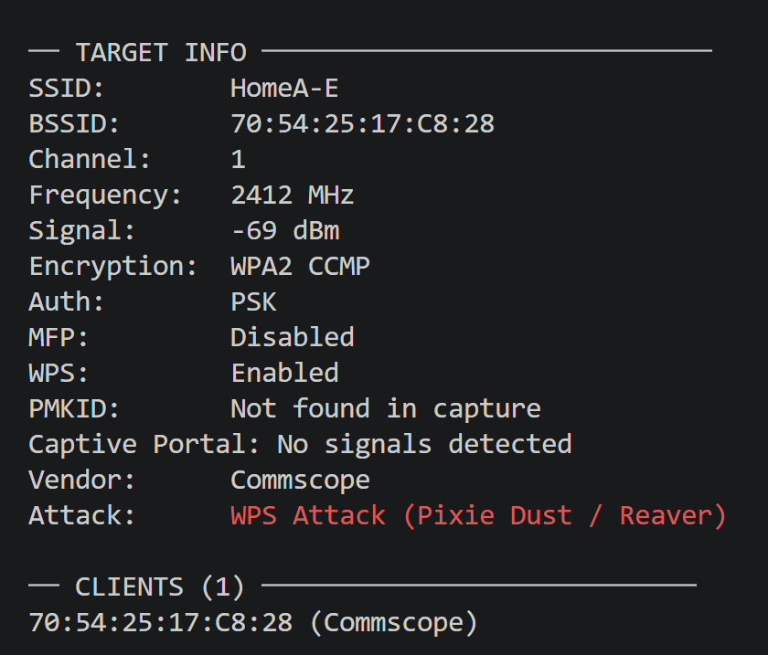
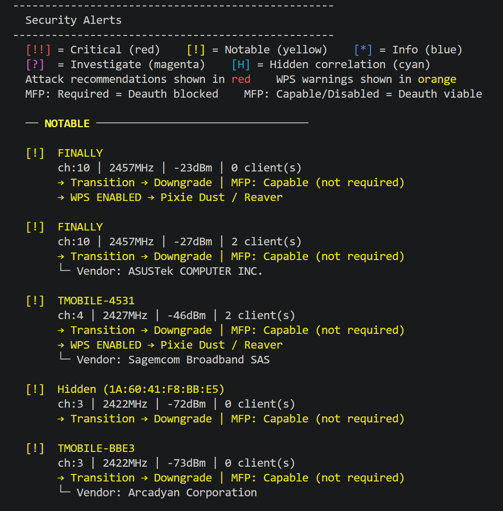

# AirScope

A wireless recon decision engine that turns raw airodump-ng captures into prioritized, actionable intelligence. Built for wireless penetration testers who want to skip the manual note-taking and get straight to attacking.

AirScope analyzes and decides. It does not attack. Once you know what to hit and how, you switch to the attack tool — hostapd, wacker, eaphammer, reaver, aireplay-ng, hashcat. AirScope's job ends there.

---

## Typical Workflow

1. Run airodump-ng and save a CSV and PCAP
2. Feed both to AirScope with `--alerts-only` to triage the environment in seconds
3. Use `--target` on your priority AP for a full intelligence breakdown and attack recommendation
4. Switch to your attack tool with everything you need already surfaced

```
python airscope.py capture.csv --pcap capture.cap --alerts-only
python airscope.py capture.csv --pcap capture.cap --target NETWORK-NAME
```

---

## What It Does

**Recon and Parsing**
- Parses airodump-ng CSV files into a clean AP and client summary
- Enriches data with PCAP beacon frame analysis for MFP status and AKM suite details
- Detects WPS-enabled networks from beacon frames for Pixie Dust / Reaver targeting
- Detects PMKID presence from EAPOL frames and flags clientless offline crack viability
- Identifies device manufacturers via IEEE OUI database lookup
- Maps channels to frequencies for tools like wacker that require MHz input
- Sorts networks by signal strength — closest targets listed first

**Intelligence Layer**
- Prioritized security alerts with color-coded severity levels
- MFP-aware attack recommendations — flags when deauth is blocked and suggests alternatives
- Hidden SSID correlation — matches hidden APs to associated client probe data to infer likely names
- Passive captive portal detection from 802.11u IE, SSID patterns, and vendor fingerprinting
- PMKID-aware attack pivoting — switches recommendation to clientless crack when PMKID is captured
- Probing client identification for evil twin and Karma attack targeting

**Output and Filtering**
- Filter by network type, encryption, client presence, or PMKID capture
- Target lookup by SSID with full intelligence breakdown and copy-paste ready attack recommendation
- Export results to text file for engagement documentation
- Color output in terminal via colorama, with graceful fallback to plain text

---

## Installation

```
git clone https://github.com/hexpluse/airscope.git
cd airscope
pip install scapy colorama
```

Download the OUI database for vendor detection:

```
python -c "import urllib.request; urllib.request.urlretrieve('https://standards-oui.ieee.org/oui/oui.txt', 'oui.txt')"
```

Scapy, colorama, and oui.txt are all optional. CSV-only mode works without any of them — the tool tells you what is missing and continues with reduced output.

---

## Target Lookup

The strongest feature. Run `--target` against any AP by SSID name to get a full breakdown with an automatic attack recommendation that factors in MFP status, WPS, and PMKID.

```
python airscope.py capture.csv --pcap capture.cap --target NETWORK-NAME
```



The attack field updates based on what was captured. If MFP is Required, deauth is flagged as blocked and the recommendation pivots. If a PMKID was captured, it switches to clientless offline cracking. If WPS is enabled, it goes straight to Pixie Dust.

---

## Security Alerts

```
python airscope.py capture.csv --pcap capture.cap --alerts-only
```



Alerts are sorted by priority. The color legend is shown at the top of every alerts run. Output is scoped to what matters — metadata is dimmed, attack recommendations are highlighted.

---

## Hidden SSID Correlation

```
python airscope.py capture.csv --pcap capture.cap --hidden
```

Matches hidden APs to associated client probe data to infer likely SSID names. Only shows APs where something was actually found. Use `--hidden-all` to include dead ends.

---

## Flags

| Flag | Description |
|------|-------------|
| --target SSID | Full intelligence breakdown and attack recommendation for a specific AP |
| --alerts-only | Skip AP listing, show only security alerts |
| --show-bssid | Include BSSID in alert output |
| --show-clients | Show connected client MACs and vendors in alerts |
| --has-clients | Only show APs with connected clients |
| --wpa2-only | Only show WPA2-PSK networks |
| --transition | Only show WPA3/WPA2 transition mode networks |
| --enterprise | Only show enterprise (MGT) networks |
| --pcap FILE | Enrich AP data with RSN/MFP/WPS/PMKID details from PCAP |
| --output FILE | Export results to a text file |
| --hidden | Hidden SSID correlation, actionable findings only |
| --hidden-all | Hidden SSID correlation including APs with no client data |
| --pmkid | Only show APs where a PMKID was captured. Requires --pcap |
| --version | Print version and exit |

---

## Captive Portal Detection

Passive detection only — no active probing. AirScope checks three independent signals on open networks:

- 802.11u Interworking IE present in beacon frames (confidence: Likely)
- SSID matches known portal patterns from carriers, hospitality chains, and inflight wifi providers
- Vendor OUI matches known portal hardware (Aruba, Meraki, Ruckus, Nomadix, etc.)

Findings are always labeled with confidence level and marked unconfirmed. Confirmation requires active association.

---

## PMKID Detection

AirScope parses EAPOL frames in the PCAP for PMKID presence. If found, the attack recommendation in `--target` switches to clientless offline cracking via hashcat with no deauth or associated client required.

Not found in capture does not mean the AP is not vulnerable. Whether a PMKID is broadcast depends on AP firmware.

---

## Dependencies

- Python 3.x (standard library only for CSV mode)
- scapy (optional, for PCAP enrichment): `pip install scapy`
- colorama (optional, for color output): `pip install colorama`
- oui.txt (optional, for vendor identification): download from IEEE

---

## Version History

- v4.5.3 — Color output via colorama with graceful fallback
- v4.5.1 — --version flag
- v4.5 — MFP-aware deauth warnings in alerts
- v4.4.1 — --pmkid filter flag
- v4.4 — PMKID detection from EAPOL frames
- v4.3 — MFP-aware attack recommendations in --target
- v4.2 — Passive captive portal detection
- v4.1 — Hidden SSID correlation with --hidden and --hidden-all
- v4.0 — Target lookup with --target and attack recommendations
- v3.5 — Code cleanup
- v3.4 — Signal strength sorting, visual redesign, --show-clients
- v3.3 — WPS detection from PCAP beacon frames
- v3.2 — Channel-to-frequency mapping
- v3.1 — OUI vendor lookup
- v3.0 — PCAP support with scapy for RSN/MFP enrichment
- v2.5 — Export to file with --output
- v2.3 — Argparse filters
- v2.2 — Security alerts with attack recommendations
- v1.0 — CSV parsing and AP/client display

---

## Author

Built by hexpluse during CWPE (Certified Wireless Pentesting Expert) certification studies. Designed to automate the wireless recon workflow repeated manually on every assessment.

## License

MIT
